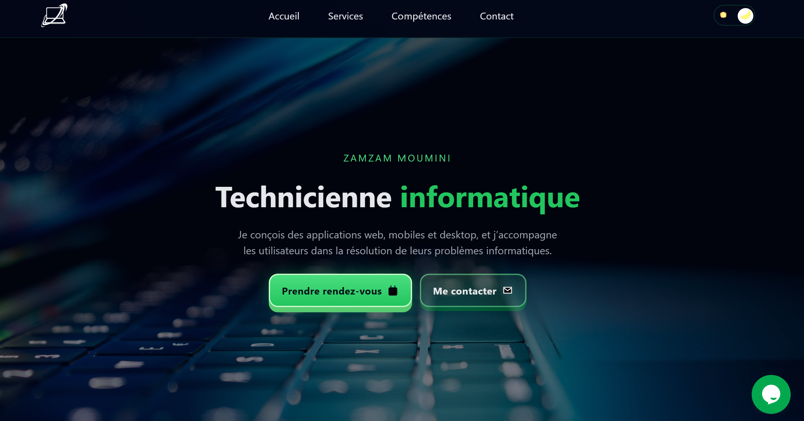

# Technicienne Informatique 



## Table des matières

- [Présentation](#présentation)
- [Objectifs du projet](#objectifs-du-projet)
- [Fonctionnalités](#fonctionnalités)
- [Expérience utilisateur](#expérience-utilisateur)
- [Technologies utilisées](#technologies-utilisées)
- [Architecture et structure](#architecture-et-structure)
- [Formulaire de contact](#formulaire-de-contact)
- [Thème clair / sombre](#thème-clair--sombre)
- [Déploiement](#déploiement)
- [Améliorations futures](#améliorations-futures)


## Présentation

Ce projet est un **site vitrine professionnel** destiné à présenter un profil de **technicienne informatique**, avec une orientation **support utilisateurs** et **développement d’outils et d’applications**.

Il a été conçu pour servir de :
- support de présentation professionnelle,
- portfolio technique,
- vitrine de compétences pour un stage ou un emploi.

Le site est entièrement responsive et pensé pour être clair, moderne et accessible.


## Objectifs du projet

- Mettre en valeur les compétences techniques et professionnelles
- Proposer une navigation fluide sur tous les supports
- Offrir une expérience utilisateur soignée
- Permettre une prise de contact simple et efficace
- Respecter de bonnes pratiques en HTML, CSS et JavaScript


## Fonctionnalités

- Menu de navigation responsive avec menu burger
- Sections structurées :
  - Accueil
  - À propos
  - Services
  - Compétences
  - Projets
  - Technologies
  - Contact
- Bouton de prise de rendez-vous externe
- Formulaire de contact fonctionnel
- Thème clair / sombre
- Animations légères pour améliorer la lisibilité
- Design moderne et cohérent


## Expérience utilisateur

- Interface lisible et aérée
- Contrastes adaptés au mode clair et au mode sombre
- Boutons et actions clairement identifiables
- Feedback utilisateur lors de l’envoi du formulaire
- Navigation fluide sur mobile, tablette et desktop


## Technologies utilisées

- **HTML5**
  - Structure sémantique
  - Accessibilité (ARIA, attributs utiles)

- **CSS3**
  - Variables CSS
  - Flexbox & Grid
  - Thèmes clair / sombre
  - Responsive design

- **JavaScript (Vanilla)**
  - Menu mobile
  - Gestion du thème
  - Validation et envoi du formulaire
  - Interactions utilisateur

- **Formspree**
  - Gestion de l’envoi des messages du formulaire

- **Calendly**
  - Prise de rendez-vous externe


## Architecture et structure

```text
/
├── index.html
├── assets/
│   ├── css/
│   │   ├── base.css
│   │   ├── layout.css
│   │   ├── component.css
│   │   └── styles.css
│   ├── js/
│   │   └── main.js
│   └── images/
│       ├── logo.png
│       ├── fond.jpg
│       ├── avatar-pro.png
│       └── preview.jpg
├── README.md
```
## Déploiement
 voir le site ici  [Live Site](https://assistant-support-it.vercel.app/)